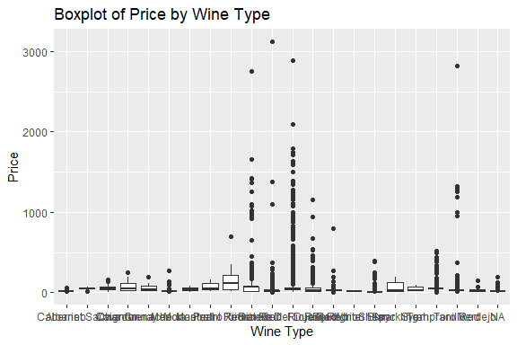
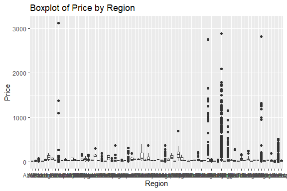
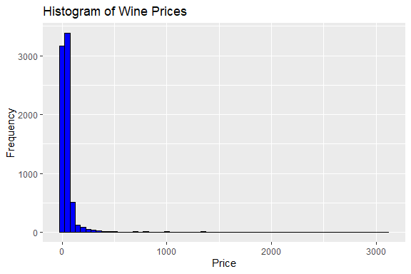
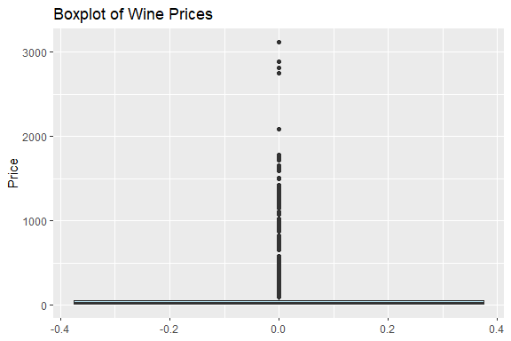
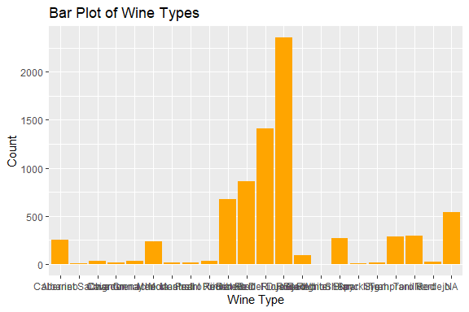
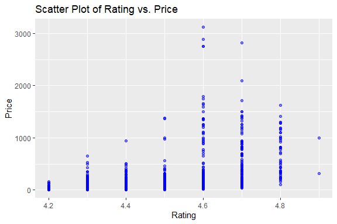
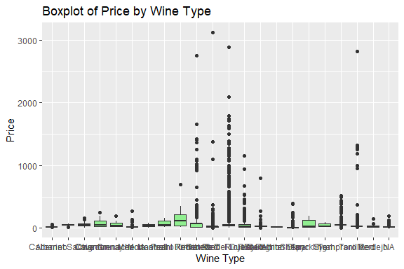
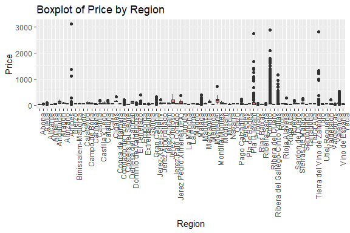
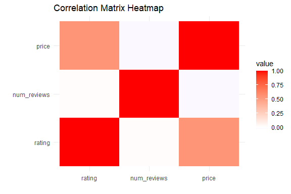
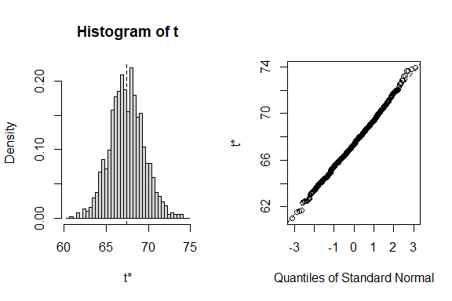

Spanish Wine Quality Prediction
================
Trevor Okinda
2024

- [Student Details](#student-details)
- [Setup Chunk](#setup-chunk)
  - [Source:](#source)
  - [Reference:](#reference)
- [Exploratory Data Analysis](#exploratory-data-analysis)
  - [Load dataset](#load-dataset)
  - [Measures of Frequency](#measures-of-frequency)
  - [Measures of Central Tendency](#measures-of-central-tendency)
  - [Measures of Distribution](#measures-of-distribution)
  - [Measures of Relationship](#measures-of-relationship)
  - [ANOVA](#anova)
  - [Plots](#plots)
- [Preprocessing and Data
  Transformation](#preprocessing-and-data-transformation)
  - [Missing Values](#missing-values)
  - [Data Cleaning](#data-cleaning)
- [Training Model](#training-model)
  - [Data Splitting](#data-splitting)
  - [Bootstrapping](#bootstrapping)

# Student Details

|                       |                                 |
|-----------------------|---------------------------------|
| **Student ID Number** | 134780                          |
| **Student Name**      | Trevor Okinda                   |
| **BBIT 4.2 Group**    | C                               |
| **Project Name**      | Spanish Wine Quality Prediction |

# Setup Chunk

**Note:** the following KnitR options have been set as the global
defaults: <BR>
`knitr::opts_chunk$set(echo = TRUE, warning = FALSE, eval = TRUE, collapse = FALSE, tidy = TRUE)`.

More KnitR options are documented here
<https://bookdown.org/yihui/rmarkdown-cookbook/chunk-options.html> and
here <https://yihui.org/knitr/options/>.

### Source:

The dataset that was used can be downloaded here: *\<<a
href="https://www.kaggle.com/datasets/fedesoriano/spanish-wine-quality-dataset\"
class="uri">https://www.kaggle.com/datasets/fedesoriano/spanish-wine-quality-dataset\</a>\>*

### Reference:

*\<fedesoriano. (April 2022). Spanish Wine Quality Dataset. Retrieved
\[Date Retrieved\] from <a
href="https://www.kaggle.com/datasets/fedesoriano/spanish-wine-quality-dataset\"
class="uri">https://www.kaggle.com/datasets/fedesoriano/spanish-wine-quality-dataset\</a>\>  
Refer to the APA 7th edition manual for rules on how to cite datasets:
<https://apastyle.apa.org/style-grammar-guidelines/references/examples/data-set-references>*

# Exploratory Data Analysis

## Load dataset

``` r
# Load the necessary package
library(readr)

# Load dataset and capture parsing issues
wine_data <- read.csv("wines_SPA.csv", colClasses = c(
  winery = "character",
  wine = "character",
  year = "character",
  rating = "numeric",
  num_reviews = "numeric",
  country = "character",
  region = "character",
  type = "factor",
  body = "factor",
  acidity = "factor",
  price = "numeric"
))

# Check for parsing issues
problems(wine_data)

# Display the structure of the dataset
str(wine_data)
```

    ## 'data.frame':    7500 obs. of  11 variables:
    ##  $ winery     : chr  "Teso La Monja" "Artadi" "Vega Sicilia" "Vega Sicilia" ...
    ##  $ wine       : chr  "Tinto" "Vina El Pison" "Unico" "Unico" ...
    ##  $ year       : chr  "2013" "2018" "2009" "1999" ...
    ##  $ rating     : num  4.9 4.9 4.8 4.8 4.8 4.8 4.8 4.8 4.8 4.8 ...
    ##  $ num_reviews: num  58 31 1793 1705 1309 ...
    ##  $ country    : chr  "Espana" "Espana" "Espana" "Espana" ...
    ##  $ region     : chr  "Toro" "Vino de Espana" "Ribera del Duero" "Ribera del Duero" ...
    ##  $ type       : Factor w/ 21 levels "Albarino","Cabernet Sauvignon",..: 20 19 12 12 12 12 12 12 12 12 ...
    ##  $ body       : Factor w/ 4 levels "2","3","4","5": 4 3 4 4 4 4 4 4 4 4 ...
    ##  $ acidity    : Factor w/ 3 levels "1","2","3": 3 2 3 3 3 3 3 3 3 3 ...
    ##  $ price      : num  995 314 325 693 778 ...

``` r
# View the first few rows of the dataset
head(wine_data)
```

    ##          winery          wine year rating num_reviews country           region
    ## 1 Teso La Monja         Tinto 2013    4.9          58  Espana             Toro
    ## 2        Artadi Vina El Pison 2018    4.9          31  Espana   Vino de Espana
    ## 3  Vega Sicilia         Unico 2009    4.8        1793  Espana Ribera del Duero
    ## 4  Vega Sicilia         Unico 1999    4.8        1705  Espana Ribera del Duero
    ## 5  Vega Sicilia         Unico 1996    4.8        1309  Espana Ribera del Duero
    ## 6  Vega Sicilia         Unico 1998    4.8        1209  Espana Ribera del Duero
    ##                   type body acidity  price
    ## 1             Toro Red    5       3 995.00
    ## 2          Tempranillo    4       2 313.50
    ## 3 Ribera Del Duero Red    5       3 324.95
    ## 4 Ribera Del Duero Red    5       3 692.96
    ## 5 Ribera Del Duero Red    5       3 778.06
    ## 6 Ribera Del Duero Red    5       3 490.00

``` r
# View the dataset in a separate viewer window
View(wine_data)
```

## Measures of Frequency

``` r
# Frequency tables for categorical variables
winery_freq <- table(wine_data$winery)
type_freq <- table(wine_data$type)

# Display the frequency tables
print("Winery Frequency:")
```

    ## [1] "Winery Frequency:"

``` r
print(winery_freq)
```

    ## 
    ##                                          A Coroa 
    ##                                                1 
    ##                                            Aalto 
    ##                                               12 
    ##                                           Abadal 
    ##                                                3 
    ##                                  Abadia Retuerta 
    ##                                               27 
    ##                               Abel Mendoza Monge 
    ##                                                4 
    ##                                   Acustic Celler 
    ##                                                1 
    ##                                      Adama Wines 
    ##                                                4 
    ##                    Adega Familiar Eladio Pineiro 
    ##                                                1 
    ##                                              AGE 
    ##                                                1 
    ##                              Agusti Torello Mata 
    ##                                                5 
    ##                                          Albamar 
    ##                                                1 
    ##                                     Albet i Noya 
    ##                                                2 
    ##                                         Algueira 
    ##                                                1 
    ##                                            Alion 
    ##                                               16 
    ##                                          Allende 
    ##                                               14 
    ##                                 Alonso & Pedrajo 
    ##                                                1 
    ##                                 Alonso del Yerro 
    ##                                                2 
    ##                                      Alta Alella 
    ##                                                4 
    ##                                          Altanza 
    ##                                                4 
    ##                                     Alto Moncayo 
    ##                                               10 
    ##                                   Altos de Rioja 
    ##                                                3 
    ##                                 Altos del Enebro 
    ##                                                1 
    ##                                 Altos del Terral 
    ##                                                1 
    ##                                    Alvaro Domecq 
    ##                                                2 
    ##                                  Alvaro Palacios 
    ##                                               48 
    ##                                           Alvear 
    ##                                                2 
    ##                                     Amos Baneres 
    ##                                                1 
    ##                                           Anayon 
    ##                                                2 
    ##                                  Anibal de Otero 
    ##                                                1 
    ##                                      Anima Negra 
    ##                                                9 
    ##                                         Antidoto 
    ##                                                3 
    ##                                             Arid 
    ##                                                1 
    ##                                         Arinzano 
    ##                                                3 
    ##                                           Artadi 
    ##                                              261 
    ##                                          Arzuaga 
    ##                                               16 
    ##                                            Aster 
    ##                                                2 
    ##                                         Astrales 
    ##                                                2 
    ##                                          Atalaya 
    ##                                                5 
    ##                                  Atlan & Artisan 
    ##                                                2 
    ##                                        Atlantida 
    ##                                                1 
    ##                                            Attis 
    ##                                                1 
    ##                                            Ausas 
    ##                                                3 
    ##                                          Avancia 
    ##                                                2 
    ##                                         Avgvstvs 
    ##                                                2 
    ##                                      Azpilicueta 
    ##                                                1 
    ##                                         Baigorri 
    ##                                                3 
    ##                                         Balandro 
    ##                                                1 
    ##                                         Baluarte 
    ##                                                1 
    ##                                        Barahonda 
    ##                                                3 
    ##                                       Barbadillo 
    ##                                                1 
    ##                                Barco del Corneta 
    ##                                                1 
    ##                                       Belondrade 
    ##                                                4 
    ##            Benjamin de Rothschild - Vega Sicilia 
    ##                                               10 
    ##                                           Berceo 
    ##                                                1 
    ##                                          Beronia 
    ##                                                2 
    ##                                        Biniagual 
    ##                                                1 
    ##                                         Binigrau 
    ##                                              220 
    ##                               Bodega Aida i Luis 
    ##                                                1 
    ##                              Bodega Campo Eliseo 
    ##                                                2 
    ##                 Bodega Contador (Benjamin Romeo) 
    ##                                               21 
    ##                                 Bodega de Bardos 
    ##                                                2 
    ##                                Bodega Elias Mora 
    ##                                                2 
    ##                        Bodega Juan Carlos Sancha 
    ##                                                2 
    ##                                 Bodega Numanthia 
    ##                                               14 
    ##                                     Bodega Otazu 
    ##                                                2 
    ##                                     Bodega Rento 
    ##                                                1 
    ##                                     Bodega Ribas 
    ##                                                2 
    ##                                    Bodega Sommos 
    ##                                                1 
    ##                                   Bodega Tameran 
    ##                                                3 
    ##                                   Bodega Tesalia 
    ##                                                2 
    ##        Bodegas 6o Elemento - Vino Sexto Elemento 
    ##                                                5 
    ##                                   Bodegas Amaren 
    ##                                                8 
    ##                               Bodegas Aragonesas 
    ##                                                2 
    ##                                     Bodegas Arfe 
    ##                                                1 
    ##                                  Bodegas Arrocal 
    ##                                                1 
    ##                           Bodegas Asenjo & Manso 
    ##                                                1 
    ##                                    Bodegas Ateca 
    ##                                                1 
    ##                            Bodegas Casa Primicia 
    ##                                                1 
    ## Bodegas Celler Francisco Castillo - Clos Dominic 
    ##                                                4 
    ##                                   Bodegas Clunia 
    ##                                                1 
    ##                                  Bodegas El Nido 
    ##                                               13 
    ##                              Bodegas El Paraguas 
    ##                                                1 
    ##                                Bodegas Estraunza 
    ##                                                1 
    ##                                 Bodegas Faustino 
    ##                                                7 
    ##                                Bodegas Frontaura 
    ##                                                2 
    ##                                Bodegas Frontonio 
    ##                                                2 
    ##                                     Bodegas Gama 
    ##                                                2 
    ##        Bodegas Imperiales - Abadia de San Quirce 
    ##                                                1 
    ##                                 Bodegas La Horra 
    ##                                              223 
    ##                               Bodegas Luis Perez 
    ##                                                2 
    ##                                 Bodegas Mas Alta 
    ##                                               14 
    ##                                    Bodegas Mauro 
    ##                                               18 
    ##                           Bodegas Monte La Reina 
    ##                                                1 
    ##                        Bodegas Naluar & Acediano 
    ##                                                4 
    ##                                    Bodegas Ochoa 
    ##                                                2 
    ##                                   Bodegas Olarra 
    ##                                                1 
    ##                                    Bodegas Reyes 
    ##                                                2 
    ##                                     Bodegas Roda 
    ##                                               23 
    ##                                Bodegas San Roman 
    ##                                                9 
    ##                                   Bodegas Tierra 
    ##                                                1 
    ##                                Bodegas Tradicion 
    ##                                                5 
    ##                                    Bodegas Urium 
    ##                                                1 
    ##                                Bodegas Valdelana 
    ##                                                1 
    ##                                 Bodegas Valduero 
    ##                                               14 
    ##                                   Bodegas Vilano 
    ##                                                4 
    ##                          Bodegas Ximenez-Spinola 
    ##                                                5 
    ##                        Bodegas Y Vinedos Alilian 
    ##                                                1 
    ##                                    Bodegas Yuste 
    ##                                                1 
    ##                                Bodegas Yzaguirre 
    ##                                                1 
    ##                                        Bohorquez 
    ##                                                1 
    ##                                  Bordalas Garcia 
    ##                                                1 
    ##                               Bosque de Matasnos 
    ##                                                5 
    ##                                            Breca 
    ##                                                1 
    ##                                           Briego 
    ##                                                1 
    ##                                      Buil & Gine 
    ##                                                1 
    ##                                   Ca l'Apotecari 
    ##                                                1 
    ##                 Cal Batllet - Celler Ripoll Sans 
    ##                                                2 
    ##                                          Cal Pla 
    ##                                                2 
    ##                                       Callejuela 
    ##                                                1 
    ##                                         Campillo 
    ##                                              223 
    ##                                     Can Axartell 
    ##                                                1 
    ##                                          Can Bas 
    ##                                                1 
    ##                             Can Rafols dels Caus 
    ##                                                2 
    ##                                        Can Xanet 
    ##                                                1 
    ##                                    Capafons-Osso 
    ##                                                1 
    ##                                      Carlos Moro 
    ##                                                3 
    ##                                    Carlos Serres 
    ##                                                1 
    ##                                   Carmelo Rodero 
    ##                                               13 
    ##                           Cartoixa de Montsalvat 
    ##                                                2 
    ##                                    Casa Castillo 
    ##                                                4 
    ##                                        Casa Rojo 
    ##                                                2 
    ##                                   Casal de Arman 
    ##                                                1 
    ##                                          Castano 
    ##                                                4 
    ##                                  Castell d'Encus 
    ##                                                4 
    ##                                Castell del Remei 
    ##                                                1 
    ##                                   Castell Miquel 
    ##                                                1 
    ##                           Castillo de Cuzcurrita 
    ##                                                3 
    ##                                Castillo Perelada 
    ##                                               12 
    ##                                Cayetano del Pino 
    ##                                                1 
    ##                               Celler de Capcanes 
    ##                                                2 
    ##                                          Cepa 21 
    ##                                                3 
    ##                                 Cepas Familiares 
    ##                                                1 
    ##                              Cerro San Cristobal 
    ##                                                1 
    ##                                         Cervoles 
    ##                                                3 
    ##                                          Chivite 
    ##                                                4 
    ##                                 Chozas Carrascal 
    ##                                                2 
    ##                                  Cillar de Silos 
    ##                                                2 
    ##                                  Cims de Porrera 
    ##                                                6 
    ##                                      Clos d'Agon 
    ##                                                3 
    ##                                     Clos Erasmus 
    ##                                               11 
    ##                                    Clos Figueras 
    ##                                                4 
    ##                                      Clos Galena 
    ##                                                4 
    ##                                     Clos Mogador 
    ##                                               20 
    ##                                        Clos Pons 
    ##                                              220 
    ##                                         Codorniu 
    ##                                                1 
    ##                          Collbaix Celler El Moli 
    ##                                                1 
    ##                                          Comenge 
    ##                                                3 
    ##                                  Condado de Haza 
    ##                                                1 
    ##                             Conreria d'Scala Dei 
    ##                                              223 
    ##                                          Contino 
    ##                                              457 
    ##                              Costers del Priorat 
    ##                                                1 
    ##                              Costers del Siurana 
    ##                                                6 
    ##                                     Cruz de Alba 
    ##                                                3 
    ##                                      Cuentavinas 
    ##                                                1 
    ##                                         Culebron 
    ##                                                1 
    ##                                     David Moreno 
    ##                                                1 
    ##                                          De Moya 
    ##                                                4 
    ##                                        De Muller 
    ##                                                2 
    ##                          Dehesa de Los Canonigos 
    ##                                                4 
    ##                              Dehesa del Carrizal 
    ##                                                3 
    ##                                   Delgado Zuleta 
    ##                                                1 
    ##                     Descendientes de J. Palacios 
    ##                                                8 
    ##                                   Diez Caballero 
    ##                                                1 
    ##                                      Diez Merito 
    ##                                                1 
    ##                                Divina Proporcion 
    ##                                                1 
    ##             Do Ferreiro (Bodegas Gerardo Mendez) 
    ##                                                2 
    ##                                  Dominio de Anza 
    ##                                                1 
    ##                                Dominio de Atauta 
    ##                                                7 
    ##                                  Dominio de Cair 
    ##                                                4 
    ##                               Dominio de Calogia 
    ##                                                1 
    ##                                    Dominio de Es 
    ##                                                5 
    ##                               Dominio de la Vega 
    ##                                                1 
    ##                                Dominio de Loalva 
    ##                                                1 
    ##                                Dominio de Pingus 
    ##                                               31 
    ##                               Dominio del Aguila 
    ##                                                8 
    ##                              Dominio del Bendito 
    ##                                                5 
    ##                                 Dominio do Bibei 
    ##                                                2 
    ##                                 Dominio Fournier 
    ##                                                1 
    ##                                         Edetaria 
    ##                                                1 
    ##                                             Edra 
    ##                                                1 
    ##                                          El Coto 
    ##                                                2 
    ##                              El Grillo y La Luna 
    ##                                                1 
    ##                               El Lagar de Isilla 
    ##                                                1 
    ##                                El Maestro Sierra 
    ##                                                2 
    ##                                       El Regajal 
    ##                                                2 
    ##                                   Emilio Hidalgo 
    ##                                                1 
    ##                                      Emilio Moro 
    ##                                               25 
    ##                                      Emilio Rojo 
    ##                                                1 
    ##                                            Enate 
    ##                                                9 
    ##                                      Enric Soler 
    ##                                                3 
    ##                                  Enrique Mendoza 
    ##                                              220 
    ##                                   Equipo Navazos 
    ##                                                3 
    ##                                        Es Fangar 
    ##                                                1 
    ##                          Espectacle del Montsant 
    ##                                                6 
    ##                                           Espelt 
    ##                                                1 
    ##                                          Estones 
    ##                                                1 
    ##                                  Eulogio Pomares 
    ##                                                2 
    ##                                   Familia Torres 
    ##                                               19 
    ##                                           Farina 
    ##                                                1 
    ##                               Federico Paternina 
    ##                                                1 
    ##                                        Fefinanes 
    ##                                                1 
    ##                                      Felix Solis 
    ##                                                1 
    ##                             Fernandez de Pierola 
    ##                                                1 
    ##                                    Fernandez Gao 
    ##                                                1 
    ##                             Fernando de Castilla 
    ##                                                1 
    ##                                     Ferrer Bobet 
    ##                                               10 
    ##                                          Figuero 
    ##                                                4 
    ##                                    Finca Moncloa 
    ##                                                2 
    ##                                  Finca Rio Negro 
    ##                                                3 
    ##                               Finca Torremilanos 
    ##                                                5 
    ##                                  Finca Valpiedra 
    ##                                                2 
    ##                                Finca Villacreces 
    ##                                                4 
    ##                                   Flor de Chasna 
    ##                                                1 
    ##                                              Fos 
    ##                                                1 
    ##                                 Francisco Barona 
    ##                                                2 
    ##                           Francisco Garcia Perez 
    ##                                                1 
    ##                                        Freixenet 
    ##                                                1 
    ##                               Galindo San Millan 
    ##                                                1 
    ##                                  Gallina de Piel 
    ##                                                1 
    ##                                           Garmon 
    ##                                                5 
    ##                                          Godeval 
    ##                                                1 
    ##                                    Gomez Cruzado 
    ##                                                6 
    ##                                   Gonzalez-Byass 
    ##                                                5 
    ##                              Goyo Garcia Viadero 
    ##                                                1 
    ##                                          Gramona 
    ##                                               10 
    ##                                          Guilera 
    ##                                                1 
    ##             Guillem Carol - Cellers Carol Valles 
    ##                                                1 
    ##                             Gutierrez de la Vega 
    ##                                                3 
    ##                                            Habla 
    ##                                                2 
    ##                                  Hacienda Grimon 
    ##                                                1 
    ##                           Hacienda Lopez de Haro 
    ##                                                2 
    ##                              Hacienda Monasterio 
    ##                                               14 
    ##                                  Hacienda Solano 
    ##                                                3 
    ##                  Hacienda Zorita Natural Reserve 
    ##                                                1 
    ##                                          Harveys 
    ##                                                2 
    ##                                  Hermanos Pecina 
    ##                                                1 
    ##                              Hidalgo (La Gitana) 
    ##                                                1 
    ##                                   Hispano Suizas 
    ##                                                2 
    ##                                 Huerta de Albala 
    ##                                                4 
    ##                                  Hugas de Batlle 
    ##                                                1 
    ##                                         Imperial 
    ##                                              228 
    ##                                        Inurrieta 
    ##                                                1 
    ##                                             Jaro 
    ##                                                4 
    ##                                      Javi Revert 
    ##                                                1 
    ##                           Javier Sanz Viticultor 
    ##                                                2 
    ##                                        Jean Leon 
    ##                                                1 
    ##                                    Jesus Madrazo 
    ##                                                2 
    ##                                    Jimenez-Landi 
    ##                                                5 
    ##                                   Joan d'Anguera 
    ##                                                1 
    ##                                        Joan Simo 
    ##                                                1 
    ##                                    Jorge Ordonez 
    ##                                                2 
    ##                                    Jorge Piernas 
    ##                                                1 
    ##                                    Jose Pariente 
    ##                                                4 
    ##                            Josep Grau Viticultor 
    ##                                                2 
    ##                                         Juan Gil 
    ##                                                7 
    ##                                      Juan Pinero 
    ##                                                2 
    ##                                     Juve & Camps 
    ##                                                2 
    ##                 l'Infernal Combier Fischer Gerin 
    ##                                                1 
    ##                                         La Legua 
    ##                                                1 
    ##                                    La Rioja Alta 
    ##                                              254 
    ##                                         La Unica 
    ##                                                1 
    ##                                           La Val 
    ##                                                1 
    ##                                     La Vicalanda 
    ##                                              223 
    ##                                La Vinya del Vuit 
    ##                                                1 
    ##                                          Ladairo 
    ##                                                1 
    ##                                 Lagar de Sabariz 
    ##                                                1 
    ##                                         Lambuena 
    ##                                                1 
    ##                                              Lan 
    ##                                                9 
    ##                                     Lar de Paula 
    ##                                                1 
    ##                                             Leda 
    ##                                                2 
    ##                                          Legaris 
    ##                                                3 
    ##                                    Llanos Negros 
    ##                                                2 
    ##                                          Llopart 
    ##                                                3 
    ##                                            Loess 
    ##                                                1 
    ##                                  Lopez Cristobal 
    ##                                                2 
    ##                                    Los Aguilares 
    ##                                                4 
    ##                                           Losada 
    ##                                              227 
    ##                                           Loxera 
    ##                                                1 
    ##                        Luis A. Rodriguez Vazquez 
    ##                                                2 
    ##                                       Luis Canas 
    ##                                                4 
    ##                                           Lustau 
    ##                                              223 
    ##                            M. Antonio de la Riva 
    ##                                                1 
    ##                                      Mandia Vell 
    ##                                                1 
    ##                                    Mar de Frades 
    ##                                              222 
    ##                                     Marco Abella 
    ##                                                2 
    ##                                Marques de Burgos 
    ##                                                1 
    ##                               Marques de Caceres 
    ##                                                8 
    ##                                Marques de Grinon 
    ##                                                4 
    ##                          Marques de la Concordia 
    ##                                                1 
    ##                              Marques de Murrieta 
    ##                                               33 
    ##                                Marques de Riscal 
    ##                                               21 
    ##                               Marques de Tomares 
    ##                                                2 
    ##                                Marques de Vargas 
    ##                                                6 
    ##                                       Marta Mate 
    ##                                                1 
    ##                                      Marti Fabra 
    ##                                                2 
    ##                                     Martin Codax 
    ##                                                2 
    ##                                         Martinet 
    ##                                               30 
    ##                                Martinez Lacuesta 
    ##                                                1 
    ##                                      Mas Bertran 
    ##                                                1 
    ##                                Mas Blanch I Jove 
    ##                                                1 
    ##                                     Mas d'en Gil 
    ##                                                7 
    ##                               Mas de les Pereres 
    ##                                                1 
    ##                                   Mas del Serral 
    ##                                                1 
    ##                                         Mas Doix 
    ##                                               13 
    ##                                       Mas Llunes 
    ##                                                1 
    ##                                      Mas Perinet 
    ##                                                1 
    ##                                    Mas Que Vinos 
    ##                                                1 
    ##                                      Matarromera 
    ##                                              232 
    ##                                            Matsu 
    ##                                              224 
    ##                                    Mauro Estevez 
    ##                                                1 
    ##                                   Merum Priorati 
    ##                                                4 
    ##                                          Mestres 
    ##                                                2 
    ##                             Micro Bio (MicroBio) 
    ##                                                1 
    ##                                    Miguel Merino 
    ##                                                4 
    ##                                  Milsetentayseis 
    ##                                                1 
    ##                                            Mocen 
    ##                                                1 
    ##                                          Monovar 
    ##                                                1 
    ##                                       Monte Real 
    ##                                                3 
    ##                                     Monteabellon 
    ##                                                1 
    ##                                      Montecastro 
    ##                                                3 
    ##                                            Morca 
    ##                                                4 
    ##                                             Muga 
    ##                                               23 
    ##                                            Murua 
    ##                                                1 
    ##                                        Murviedro 
    ##                                                1 
    ##                                           Museum 
    ##                                                1 
    ##                                      Mustiguillo 
    ##                                              222 
    ##                                             Naia 
    ##                                                1 
    ##                                          Navajas 
    ##                                                1 
    ##                                              Neo 
    ##                                                2 
    ##                                            Neton 
    ##                                                1 
    ##                                        Nin-Ortiz 
    ##                                                3 
    ##                                   Noelia Bebelia 
    ##                                                1 
    ##                                       Olivardots 
    ##                                                1 
    ##                                  Olivier Riviere 
    ##                                                1 
    ##                                    Oller del Mas 
    ##                                                1 
    ##                                          Ontanon 
    ##                                                2 
    ##                                            Orben 
    ##                                                2 
    ##                                          Ordonez 
    ##                                                5 
    ##                                          Osborne 
    ##                                                5 
    ##                                           Ossian 
    ##                                                7 
    ##                                           Ostatu 
    ##                                                3 
    ##                                       Oxer Wines 
    ##                                                4 
    ##                                      Paco & Lola 
    ##                                                1 
    ##                                  Pago Calzadilla 
    ##                                                2 
    ##                              Pago de Carraovejas 
    ##                                               11 
    ##                               Pago de Larrainzar 
    ##                                                2 
    ##                           Pago de Los Capellanes 
    ##                                               19 
    ##                              Pago de Vallegarcia 
    ##                                                5 
    ##                                  Pago del Vostal 
    ##                                                1 
    ##                                 Palacios Remondo 
    ##                                                1 
    ##                                  Palmeri Sicilia 
    ##                                                1 
    ##                                       Particular 
    ##                                                1 
    ##                                   Pazo Barrantes 
    ##                                                2 
    ##                                 Pazo de Rubianes 
    ##                                                1 
    ##                                    Pazo Senorans 
    ##                                                4 
    ##                                       Pedralonga 
    ##                                                3 
    ##                                         Penafiel 
    ##                                                3 
    ##                       Pepe Mendoza Casa Agricola 
    ##                                                1 
    ##                                   Perez Barquero 
    ##                                                1 
    ##                                          Perinet 
    ##                                                2 
    ##                                            Pinea 
    ##                                                2 
    ##                                    Pinna Fidelis 
    ##                                                1 
    ##                                           Pintia 
    ##                                               14 
    ##                                         Pittacum 
    ##                                                1 
    ##                               Portal del Priorat 
    ##                                              225 
    ##                                           Portia 
    ##                                                1 
    ##                                         Pradorey 
    ##                                                4 
    ##                                           Protos 
    ##                                               11 
    ##                     Proyecto Garnachas de Espana 
    ##                                                1 
    ##                                          Pujanza 
    ##                                                8 
    ##                             Quinta de la Quietud 
    ##                                                2 
    ##                                  Quinta Sardonia 
    ##                                                4 
    ##                              R. Lopez de Heredia 
    ##                                               13 
    ##                                  Rafael Palacios 
    ##                                                5 
    ##                                     Ramon Bilbao 
    ##                                              225 
    ##                                   Ramon do Casar 
    ##                                              220 
    ##                                       Ramos-Paul 
    ##                                                1 
    ##                                       Raul Perez 
    ##                                                3 
    ##                                     Real de Asua 
    ##                                                2 
    ##                                         Recaredo 
    ##                                               12 
    ##                                        Remelluri 
    ##                                               13 
    ##                                Remirez de Ganuza 
    ##                                               79 
    ##                                          Resalte 
    ##                                                2 
    ##                                          Rimarts 
    ##                                                1 
    ##                                Rodriguez de Vera 
    ##                                                2 
    ##                                  Rodriguez Sanzo 
    ##                                                1 
    ##                                      Roig Parals 
    ##                                                1 
    ##                                           Romate 
    ##                                                4 
    ##                                     Sacristia AB 
    ##                                                2 
    ##                                          Samsara 
    ##                                                1 
    ##                                       San Cobate 
    ##                                                1 
    ##                                 Sangenis I Vaque 
    ##                                                2 
    ##                                  Santa Petronila 
    ##                                                1 
    ##                                    Santiago Ruiz 
    ##                                                1 
    ##                        Sara Perez y Rene Barbier 
    ##                                                2 
    ##                                        Scala Dei 
    ##                                               10 
    ##                                            Sebio 
    ##                                                3 
    ##                                         Sei Solo 
    ##                                              225 
    ##                           Senorio de San Vicente 
    ##                                                6 
    ##                                            Shaya 
    ##                                                1 
    ##                                 Sierra Cantabria 
    ##                                              237 
    ##                                   Sierra Salinas 
    ##                                                1 
    ##                                        Sonsierra 
    ##                                                1 
    ##                                  Sota els Angels 
    ##                                                1 
    ##                                      St. Petroni 
    ##                                                2 
    ##                                            Taron 
    ##                                                2 
    ##                                           Tarsus 
    ##                                                2 
    ##                                  Telmo Rodriguez 
    ##                                                6 
    ##                                      Terra d'Uro 
    ##                                                1 
    ##                                     Terra Remota 
    ##                                                4 
    ##                                     Terras Gauda 
    ##                                                4 
    ##                               Territorio Luthier 
    ##                                                4 
    ##                        Terroir Al Limit Soc. Lda 
    ##                                               10 
    ##                                    Teso La Monja 
    ##                                               17 
    ##                                   Tinto Pesquera 
    ##                                               14 
    ##                                         Tio Pepe 
    ##                                                1 
    ##                                            Tobia 
    ##                                                4 
    ##                                    Tomas Postigo 
    ##                                                8 
    ##                                       Ton Rimbau 
    ##                                                1 
    ##                                      Toro Albala 
    ##                                               23 
    ##                                     Torre de Ona 
    ##                                                4 
    ##                                   Traslascuestas 
    ##                                                1 
    ##                                     Tres Piedras 
    ##                                                1 
    ##                              Tresmano - Tr3smano 
    ##                                                4 
    ##                                         Tridente 
    ##                                                6 
    ##                                             Trus 
    ##                                                2 
    ##                                      Ukan Winery 
    ##                                                2 
    ##                              Uvaguilera Aguilera 
    ##                                                1 
    ##                                      Valdecuevas 
    ##                                                1 
    ##                                  Valdelosfrailes 
    ##                                                1 
    ##                                         Valderiz 
    ##                                                4 
    ##                                       Valdespino 
    ##                                                3 
    ##                                         Valdubon 
    ##                                                1 
    ##                                        VALENCISO 
    ##                                                3 
    ##                                       Vall Llach 
    ##                                                8 
    ##                                     Valquejigoso 
    ##                                                3 
    ##                                       Valserrano 
    ##                                                1 
    ##                                      Valtravieso 
    ##                                                2 
    ##                                     Vega Sicilia 
    ##                                               97 
    ##                                        Vegalfaro 
    ##                                                1 
    ##                                       Veigamoura 
    ##                                                1 
    ##                                  Venta Las Vacas 
    ##                                                2 
    ##                               Venus la Universal 
    ##                                                3 
    ##                                 Veronica Salgado 
    ##                                                1 
    ##                          Vina al Lado de la Casa 
    ##                                                1 
    ##                                     Vina Pedrosa 
    ##                                              230 
    ##                                       Vina Pomal 
    ##                                                4 
    ##                                        Vina Real 
    ##                                                1 
    ##                                      Vina Sastre 
    ##                                               25 
    ##                                  Vinas del Cenit 
    ##                                                1 
    ##                                   Vinas del Vero 
    ##                                                4 
    ##                               Vinedos de Paganos 
    ##                                              175 
    ##                         Vinedos Hermanos Hernaiz 
    ##                                                2 
    ##                                    Vinicola Real 
    ##                                               11 
    ##                                     Vinos Guerra 
    ##                                                1 
    ##                                       Vinos Sanz 
    ##                                                1 
    ##                             Vins Miquel Gelabert 
    ##                                                1 
    ##                                Vinyes del Terrer 
    ##                                                1 
    ##                               Vinyes dels Aspres 
    ##                                                1 
    ##                                  Vinyes Domenech 
    ##                                                4 
    ##                            Virgen de la Asuncion 
    ##                                                1 
    ##                                         Vivaltus 
    ##                                                1 
    ##                                          Vivanco 
    ##                                                2 
    ##                                         Vizcarra 
    ##                                                7 
    ##                                           Volver 
    ##                                                6 
    ##                               Williams & Humbert 
    ##                                                4 
    ##                                            Xaloc 
    ##                                                1 
    ##                                            Ysios 
    ##                                                3 
    ##                                           Zarate 
    ##                                                1 
    ##                                            Zifar 
    ##                                                2

``` r
print("Type Frequency:")
```

    ## [1] "Type Frequency:"

``` r
print(type_freq)
```

    ## 
    ##             Albarino   Cabernet Sauvignon                 Cava 
    ##                  252                   11                   33 
    ##           Chardonnay             Grenache               Mencia 
    ##                   13                   35                  235 
    ##           Monastrell         Montsant Red        Pedro Ximenez 
    ##                   18                   17                   35 
    ##          Priorat Red                  Red Ribera Del Duero Red 
    ##                  674                  864                 1407 
    ##            Rioja Red          Rioja White      Sauvignon Blanc 
    ##                 2357                   92                    4 
    ##               Sherry            Sparkling                Syrah 
    ##                  274                    5                   15 
    ##          Tempranillo             Toro Red              Verdejo 
    ##                  291                  296                   27

## Measures of Central Tendency

``` r
# Mean, median, and mode for numeric variables
mean_rating <- mean(wine_data$rating, na.rm = TRUE)
median_rating <- median(wine_data$rating, na.rm = TRUE)
mode_rating <- as.numeric(names(sort(table(wine_data$rating), decreasing = TRUE)[1]))

mean_num_reviews <- mean(wine_data$num_reviews, na.rm = TRUE)
median_num_reviews <- median(wine_data$num_reviews, na.rm = TRUE)
mode_num_reviews <- as.numeric(names(sort(table(wine_data$num_reviews), decreasing = TRUE)[1]))

mean_price <- mean(wine_data$price, na.rm = TRUE)
median_price <- median(wine_data$price, na.rm = TRUE)
mode_price <- as.numeric(names(sort(table(wine_data$price), decreasing = TRUE)[1]))

# Display the measures of central tendency
print(paste("Mean Rating:", mean_rating))
```

    ## [1] "Mean Rating: 4.25493333333333"

``` r
print(paste("Median Rating:", median_rating))
```

    ## [1] "Median Rating: 4.2"

``` r
print(paste("Mode Rating:", mode_rating))
```

    ## [1] "Mode Rating: 4.2"

``` r
print(paste("Mean Number of Reviews:", mean_num_reviews))
```

    ## [1] "Mean Number of Reviews: 451.109066666667"

``` r
print(paste("Median Number of Reviews:", median_num_reviews))
```

    ## [1] "Median Number of Reviews: 404"

``` r
print(paste("Mode Number of Reviews:", mode_num_reviews))
```

    ## [1] "Mode Number of Reviews: 420"

``` r
print(paste("Mean Price:", mean_price))
```

    ## [1] "Mean Price: 60.095821871604"

``` r
print(paste("Median Price:", median_price))
```

    ## [1] "Median Price: 28.53"

``` r
print(paste("Mode Price:", mode_price))
```

    ## [1] "Mode Price: 37.9"

## Measures of Distribution

``` r
# Standard deviation, variance, range, and IQR for numeric variables
sd_rating <- sd(wine_data$rating, na.rm = TRUE)
var_rating <- var(wine_data$rating, na.rm = TRUE)
range_rating <- range(wine_data$rating, na.rm = TRUE)
iqr_rating <- IQR(wine_data$rating, na.rm = TRUE)

sd_num_reviews <- sd(wine_data$num_reviews, na.rm = TRUE)
var_num_reviews <- var(wine_data$num_reviews, na.rm = TRUE)
range_num_reviews <- range(wine_data$num_reviews, na.rm = TRUE)
iqr_num_reviews <- IQR(wine_data$num_reviews, na.rm = TRUE)

sd_price <- sd(wine_data$price, na.rm = TRUE)
var_price <- var(wine_data$price, na.rm = TRUE)
range_price <- range(wine_data$price, na.rm = TRUE)
iqr_price <- IQR(wine_data$price, na.rm = TRUE)

# Display the measures of distribution
print(paste("Standard Deviation of Rating:", sd_rating))
```

    ## [1] "Standard Deviation of Rating: 0.118029034574644"

``` r
print(paste("Variance of Rating:", var_rating))
```

    ## [1] "Variance of Rating: 0.0139308530026226"

``` r
print(paste("Range of Rating:", paste(range_rating, collapse = " - ")))
```

    ## [1] "Range of Rating: 4.2 - 4.9"

``` r
print(paste("IQR of Rating:", iqr_rating))
```

    ## [1] "IQR of Rating: 0"

``` r
print(paste("Standard Deviation of Number of Reviews:", sd_num_reviews))
```

    ## [1] "Standard Deviation of Number of Reviews: 723.001856195637"

``` r
print(paste("Variance of Number of Reviews:", var_num_reviews))
```

    ## [1] "Variance of Number of Reviews: 522731.684062337"

``` r
print(paste("Range of Number of Reviews:", paste(range_num_reviews, collapse = " - ")))
```

    ## [1] "Range of Number of Reviews: 25 - 32624"

``` r
print(paste("IQR of Number of Reviews:", iqr_num_reviews))
```

    ## [1] "IQR of Number of Reviews: 26"

``` r
print(paste("Standard Deviation of Price:", sd_price))
```

    ## [1] "Standard Deviation of Price: 150.356676452683"

``` r
print(paste("Variance of Price:", var_price))
```

    ## [1] "Variance of Price: 22607.1301538968"

``` r
print(paste("Range of Price:", paste(range_price, collapse = " - ")))
```

    ## [1] "Range of Price: 4.99 - 3119.08"

``` r
print(paste("IQR of Price:", iqr_price))
```

    ## [1] "IQR of Price: 32.45"

## Measures of Relationship

``` r
# Correlation matrix for numeric variables
cor_matrix <- cor(wine_data[, c("rating", "num_reviews", "price")], use = "complete.obs")

# Display the correlation matrix
print("Correlation Matrix:")
```

    ## [1] "Correlation Matrix:"

``` r
print(cor_matrix)
```

    ##                 rating num_reviews       price
    ## rating      1.00000000  0.01522883  0.54480890
    ## num_reviews 0.01522883  1.00000000 -0.03008303
    ## price       0.54480890 -0.03008303  1.00000000

## ANOVA

``` r
# Load necessary packages
library(dplyr)
```

    ## 
    ## Attaching package: 'dplyr'

    ## The following objects are masked from 'package:stats':
    ## 
    ##     filter, lag

    ## The following objects are masked from 'package:base':
    ## 
    ##     intersect, setdiff, setequal, union

``` r
library(car)  # For Levene's Test
```

    ## Loading required package: carData

    ## 
    ## Attaching package: 'car'

    ## The following object is masked from 'package:dplyr':
    ## 
    ##     recode

``` r
library(ggplot2)  # For visualizing residuals


# Convert year to numeric, handling "N.V." and other non-numeric values
wine_data$year <- ifelse(wine_data$year == "N.V.", NA, as.integer(wine_data$year))

# ANOVA: Effect of wine type on price
anova_type <- aov(price ~ type, data = wine_data)
summary(anova_type)
```

    ##               Df    Sum Sq Mean Sq F value Pr(>F)    
    ## type          20   7384135  369207   15.89 <2e-16 ***
    ## Residuals   6934 161060886   23228                   
    ## ---
    ## Signif. codes:  0 '***' 0.001 '**' 0.01 '*' 0.05 '.' 0.1 ' ' 1
    ## 545 observations deleted due to missingness

``` r
# ANOVA: Effect of region on price
anova_region <- aov(price ~ region, data = wine_data)
summary(anova_region)
```

    ##               Df    Sum Sq Mean Sq F value Pr(>F)    
    ## region        75   8905557  118741   5.488 <2e-16 ***
    ## Residuals   7424 160625312   21636                   
    ## ---
    ## Signif. codes:  0 '***' 0.001 '**' 0.01 '*' 0.05 '.' 0.1 ' ' 1

## Plots

``` r
# Visualization of results
# Boxplot of price by type
ggplot(wine_data, aes(x = type, y = price)) +
  geom_boxplot() +
  labs(title = "Boxplot of Price by Wine Type", x = "Wine Type", y = "Price")
```

<!-- -->

``` r
# Boxplot of price by region
ggplot(wine_data, aes(x = region, y = price)) +
  geom_boxplot() +
  labs(title = "Boxplot of Price by Region", x = "Region", y = "Price")
```

<!-- -->

``` r
# Load necessary packages
library(ggplot2)
library(reshape2)


# Convert year to numeric, handling "N.V." and other non-numeric values
wine_data$year <- ifelse(wine_data$year == "N.V.", NA, as.integer(wine_data$year))

# Univariate Plots

# Histogram for price
ggplot(wine_data, aes(x = price)) +
  geom_histogram(binwidth = 50, fill = "blue", color = "black") +
  labs(title = "Histogram of Wine Prices", x = "Price", y = "Frequency")
```

<!-- -->

``` r
# Boxplot for price
ggplot(wine_data, aes(y = price)) +
  geom_boxplot(fill = "lightblue") +
  labs(title = "Boxplot of Wine Prices", y = "Price")
```

<!-- -->

``` r
# Bar plot for type
ggplot(wine_data, aes(x = type)) +
  geom_bar(fill = "orange") +
  labs(title = "Bar Plot of Wine Types", x = "Wine Type", y = "Count")
```

<!-- -->

``` r
# Multivariate Plots

# Scatter plot for rating vs. price
ggplot(wine_data, aes(x = rating, y = price)) +
  geom_point(color = "blue", alpha = 0.5) +
  labs(title = "Scatter Plot of Rating vs. Price", x = "Rating", y = "Price")
```

<!-- -->

``` r
# Boxplot of price by type
ggplot(wine_data, aes(x = type, y = price)) +
  geom_boxplot(fill = "lightgreen") +
  labs(title = "Boxplot of Price by Wine Type", x = "Wine Type", y = "Price")
```

<!-- -->

``` r
# Boxplot of price by region
ggplot(wine_data, aes(x = region, y = price)) +
  geom_boxplot(fill = "lightcoral") +
  labs(title = "Boxplot of Price by Region", x = "Region", y = "Price") +
  theme(axis.text.x = element_text(angle = 90, hjust = 1))
```

<!-- -->

``` r
# Correlation matrix heatmap

# Compute correlation matrix
cor_matrix <- cor(wine_data[, c("rating", "num_reviews", "price")], use = "complete.obs")

# Melt the correlation matrix into long format
melted_cor_matrix <- melt(cor_matrix)

# Plot heatmap
ggplot(melted_cor_matrix, aes(x = Var1, y = Var2, fill = value)) +
  geom_tile() +
  scale_fill_gradient2(low = "blue", high = "red", mid = "white", midpoint = 0) +
  labs(title = "Correlation Matrix Heatmap", x = "", y = "") +
  theme_minimal()
```

<!-- -->

# Preprocessing and Data Transformation

## Missing Values

``` r
# Load necessary packages
library(VIM)
```

    ## Loading required package: colorspace

    ## Loading required package: grid

    ## The legacy packages maptools, rgdal, and rgeos, underpinning the sp package,
    ## which was just loaded, will retire in October 2023.
    ## Please refer to R-spatial evolution reports for details, especially
    ## https://r-spatial.org/r/2023/05/15/evolution4.html.
    ## It may be desirable to make the sf package available;
    ## package maintainers should consider adding sf to Suggests:.
    ## The sp package is now running under evolution status 2
    ##      (status 2 uses the sf package in place of rgdal)

    ## VIM is ready to use.

    ## Suggestions and bug-reports can be submitted at: https://github.com/statistikat/VIM/issues

    ## 
    ## Attaching package: 'VIM'

    ## The following object is masked from 'package:datasets':
    ## 
    ##     sleep

``` r
library(naniar)

# Summary of missing values
summary(wine_data)
```

    ##     winery              wine                year          rating     
    ##  Length:7500        Length:7500        Min.   :1910   Min.   :4.200  
    ##  Class :character   Class :character   1st Qu.:2011   1st Qu.:4.200  
    ##  Mode  :character   Mode  :character   Median :2015   Median :4.200  
    ##                                        Mean   :2013   Mean   :4.255  
    ##                                        3rd Qu.:2017   3rd Qu.:4.200  
    ##                                        Max.   :2021   Max.   :4.900  
    ##                                        NA's   :290                   
    ##   num_reviews        country             region         
    ##  Min.   :   25.0   Length:7500        Length:7500       
    ##  1st Qu.:  389.0   Class :character   Class :character  
    ##  Median :  404.0   Mode  :character   Mode  :character  
    ##  Mean   :  451.1                                        
    ##  3rd Qu.:  415.0                                        
    ##  Max.   :32624.0                                        
    ##                                                         
    ##                    type        body      acidity         price        
    ##  Rioja Red           :2357   2   :  34   1   :  35   Min.   :   4.99  
    ##  Ribera Del Duero Red:1407   3   : 553   2   : 268   1st Qu.:  18.90  
    ##  Red                 : 864   4   :4120   3   :6028   Median :  28.53  
    ##  Priorat Red         : 674   5   :1624   NA's:1169   Mean   :  60.10  
    ##  Toro Red            : 296   NA's:1169               3rd Qu.:  51.35  
    ##  (Other)             :1357                           Max.   :3119.08  
    ##  NA's                : 545

``` r
# Count of missing values in each column
sapply(wine_data, function(x) sum(is.na(x)))
```

    ##      winery        wine        year      rating num_reviews     country 
    ##           0           0         290           0           0           0 
    ##      region        type        body     acidity       price 
    ##           0         545        1169        1169           0

``` r
# Percentage of missing values in each column
sapply(wine_data, function(x) mean(is.na(x)) * 100)
```

    ##      winery        wine        year      rating num_reviews     country 
    ##    0.000000    0.000000    3.866667    0.000000    0.000000    0.000000 
    ##      region        type        body     acidity       price 
    ##    0.000000    7.266667   15.586667   15.586667    0.000000

``` r
# Total number of missing values
sum(is.na(wine_data))
```

    ## [1] 3173

``` r
# Rows with missing values
missing_rows <- wine_data[!complete.cases(wine_data), ]
head(missing_rows)
```

    ##             winery                           wine year rating num_reviews
    ## 21      Valdespino               Toneles Moscatel   NA    4.8         174
    ## 47    Vega Sicilia Unico Reserva Especial Edicion   NA    4.7       12421
    ## 121  Finca Moncloa               Tintilla de Rota 2016    4.7          92
    ## 134     Barbadillo   Reliquia Palo Cortado Sherry   NA    4.7          58
    ## 143         Alvear      Abuelo Diego Palo Cortado   NA    4.7          42
    ## 144 Equipo Navazos          La Bota 78 de Oloroso   NA    4.7          41
    ##     country             region                 type body acidity  price
    ## 21   Espana Jerez-Xeres-Sherry               Sherry    4       3 253.00
    ## 47   Espana   Ribera del Duero Ribera Del Duero Red    5       3 423.50
    ## 121  Espana              Cadiz                 <NA> <NA>    <NA>  43.13
    ## 134  Espana Jerez Palo Cortado               Sherry    4       3 380.00
    ## 143  Espana   Montilla-Moriles        Pedro Ximenez    5       1 114.28
    ## 144  Espana         Manzanilla               Sherry    4       3  95.57

``` r
# Visualization of missing values

# Using VIM package
aggr_plot <- aggr(wine_data, col = c('navyblue', 'red'), numbers = TRUE, sortVars = TRUE, labels = names(wine_data), cex.axis = 0.7, gap = 3, ylab = c("Missing data", "Pattern"))
```

<!-- -->

    ## 
    ##  Variables sorted by number of missings: 
    ##     Variable      Count
    ##         body 0.15586667
    ##      acidity 0.15586667
    ##         type 0.07266667
    ##         year 0.03866667
    ##       winery 0.00000000
    ##         wine 0.00000000
    ##       rating 0.00000000
    ##  num_reviews 0.00000000
    ##      country 0.00000000
    ##       region 0.00000000
    ##        price 0.00000000

``` r
# Using naniar package
gg_miss_var(wine_data, show_pct = TRUE) +
  labs(title = "Missing Values by Variable")
```

<!-- -->

## Data Cleaning

``` r
# Load necessary packages
library(dplyr)
library(tidyr)
```

    ## 
    ## Attaching package: 'tidyr'

    ## The following object is masked from 'package:reshape2':
    ## 
    ##     smiths

``` r
# Remove rows with missing values
wine_data_clean <- wine_data %>%
  drop_na()

# Display the structure of the cleaned dataset
str(wine_data_clean)
```

    ## 'data.frame':    6070 obs. of  11 variables:
    ##  $ winery     : chr  "Teso La Monja" "Artadi" "Vega Sicilia" "Vega Sicilia" ...
    ##  $ wine       : chr  "Tinto" "Vina El Pison" "Unico" "Unico" ...
    ##  $ year       : int  2013 2018 2009 1999 1996 1998 2010 1995 2015 2011 ...
    ##  $ rating     : num  4.9 4.9 4.8 4.8 4.8 4.8 4.8 4.8 4.8 4.8 ...
    ##  $ num_reviews: num  58 31 1793 1705 1309 ...
    ##  $ country    : chr  "Espana" "Espana" "Espana" "Espana" ...
    ##  $ region     : chr  "Toro" "Vino de Espana" "Ribera del Duero" "Ribera del Duero" ...
    ##  $ type       : Factor w/ 21 levels "Albarino","Cabernet Sauvignon",..: 20 19 12 12 12 12 12 12 12 12 ...
    ##  $ body       : Factor w/ 4 levels "2","3","4","5": 4 3 4 4 4 4 4 4 4 4 ...
    ##  $ acidity    : Factor w/ 3 levels "1","2","3": 3 2 3 3 3 3 3 3 3 3 ...
    ##  $ price      : num  995 314 325 693 778 ...

``` r
# View the first few rows of the cleaned dataset
head(wine_data_clean)
```

    ##          winery          wine year rating num_reviews country           region
    ## 1 Teso La Monja         Tinto 2013    4.9          58  Espana             Toro
    ## 2        Artadi Vina El Pison 2018    4.9          31  Espana   Vino de Espana
    ## 3  Vega Sicilia         Unico 2009    4.8        1793  Espana Ribera del Duero
    ## 4  Vega Sicilia         Unico 1999    4.8        1705  Espana Ribera del Duero
    ## 5  Vega Sicilia         Unico 1996    4.8        1309  Espana Ribera del Duero
    ## 6  Vega Sicilia         Unico 1998    4.8        1209  Espana Ribera del Duero
    ##                   type body acidity  price
    ## 1             Toro Red    5       3 995.00
    ## 2          Tempranillo    4       2 313.50
    ## 3 Ribera Del Duero Red    5       3 324.95
    ## 4 Ribera Del Duero Red    5       3 692.96
    ## 5 Ribera Del Duero Red    5       3 778.06
    ## 6 Ribera Del Duero Red    5       3 490.00

``` r
# Total number of missing values
sum(is.na(wine_data_clean))
```

    ## [1] 0

``` r
# Load necessary libraries
library(dplyr)

# Drop the 'year' and 'country' columns from the dataset
wine_data_clean <- wine_data_clean %>% select(-year, -country)

# Verify that the columns have been removed
str(wine_data_clean)
```

    ## 'data.frame':    6070 obs. of  9 variables:
    ##  $ winery     : chr  "Teso La Monja" "Artadi" "Vega Sicilia" "Vega Sicilia" ...
    ##  $ wine       : chr  "Tinto" "Vina El Pison" "Unico" "Unico" ...
    ##  $ rating     : num  4.9 4.9 4.8 4.8 4.8 4.8 4.8 4.8 4.8 4.8 ...
    ##  $ num_reviews: num  58 31 1793 1705 1309 ...
    ##  $ region     : chr  "Toro" "Vino de Espana" "Ribera del Duero" "Ribera del Duero" ...
    ##  $ type       : Factor w/ 21 levels "Albarino","Cabernet Sauvignon",..: 20 19 12 12 12 12 12 12 12 12 ...
    ##  $ body       : Factor w/ 4 levels "2","3","4","5": 4 3 4 4 4 4 4 4 4 4 ...
    ##  $ acidity    : Factor w/ 3 levels "1","2","3": 3 2 3 3 3 3 3 3 3 3 ...
    ##  $ price      : num  995 314 325 693 778 ...

# Training Model

## Data Splitting

``` r
# Load necessary packages
library(caTools)

# Ensure reproducibility
set.seed(123)

# Create a partition index
split <- sample.split(wine_data_clean$price, SplitRatio = 0.8)

# Split the data into training and testing sets
train_data <- subset(wine_data_clean, split == TRUE)
test_data <- subset(wine_data_clean, split == FALSE)

# Display the structure of the training and testing sets
dim(test_data)
```

    ## [1] 1000    9

``` r
dim(train_data)
```

    ## [1] 5070    9

## Bootstrapping

``` r
# Load necessary packages
library(boot)
```

    ## 
    ## Attaching package: 'boot'

    ## The following object is masked from 'package:car':
    ## 
    ##     logit

``` r
# Ensure reproducibility
set.seed(123)

# Function to calculate the statistic of interest
bootstrap_stat <- function(data, indices) {
  sample_data <- data[indices, ]  # Resample with replacement
  return(mean(sample_data$price)) # Calculate the mean of the price variable
}

# Perform bootstrapping
bootstrap_results <- boot(data = wine_data_clean, statistic = bootstrap_stat, R = 1000)

# Summary of bootstrap results
print(bootstrap_results)
```

    ## 
    ## ORDINARY NONPARAMETRIC BOOTSTRAP
    ## 
    ## 
    ## Call:
    ## boot(data = wine_data_clean, statistic = bootstrap_stat, R = 1000)
    ## 
    ## 
    ## Bootstrap Statistics :
    ##     original     bias    std. error
    ## t1*  67.3977 0.02114763    2.045055

``` r
# Plot the bootstrap distribution
plot(bootstrap_results)
```

<!-- -->
